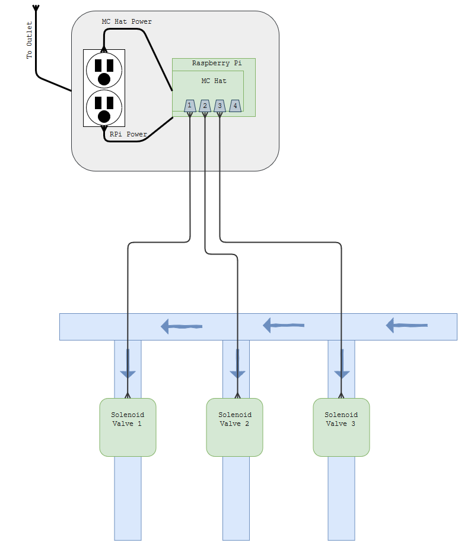

Water My Yard
=============

This is a simple DIY project to allow for an API controlled above ground irrigation system. I wanted a cost affective and localized build setup.

### Setup
This project assumes you have a Raspberry Pi configured using Rasbian with ssh access enabled (ssh is only needed for deploy code remotely) and Node.js installed (in userspace with nvm preferably).

```
git clone https://github.com/ScottONeal/water-my-yard
cd water-my-yard
  script/deploy.sh $RPI_USER $RPI_HOST
```

You should see the following similar output:
```
$ scripts/deploy.sh water my.yard
Syncing files to water@my.yard
Installing Water My Yard
Installing npm dependencies
Checking for pm2
Starting Water My Yard
```

__Essential Components:__

- Raspberry Pi 3
- [SB Components RPi Motor controller](https://www.amazon.com/Motorshield-Raspberry-Expansion-Control-ultrasonic/dp/B01MQ2MZDV/ref=sr_1_3?keywords=sb+motor+controller&qid=1555274099&s=electronics&sr=1-3-catcorr)
- [Orbit 3-Valve Array](https://www.amazon.com/Orbit-57253-3-Valve-Preassembled-Manifold/dp/B001H1NGOI/ref=sr_1_1?keywords=orbit+solenoid+three&qid=1555274030&s=electronics&sr=8-1)

__Non Essential Components:__

- [Weather Box](https://www.amazon.com/gp/product/B000VYGMF2/ref=ppx_yo_dt_b_asin_title_o00_s00?ie=UTF8&psc=1)
- [24v@0.5amp Power Supply Adapter](https://www.amazon.com/gp/product/B0797LCBYS/ref=ppx_yo_dt_b_asin_title_o02_s00?ie=UTF8&psc=1)
- 4x [3/4" Garden Hose Adapter](https://www.homedepot.com/p/Everbilt-Lead-Free-Brass-Garden-Hose-Adapter-3-4-in-MGH-x-3-4-in-MIP-x-Tapped-1-2-in-FIP-801709/300095988)
- 4x [3/4" PVC Female FPT Adapter](https://www.homedepot.com/p/Charlotte-Pipe-3-4-in-PVC-Sch-40-Female-S-x-FPT-Adapter-PVC021010800HD/203811408?keyword=611942037704)

### High View Diagram
